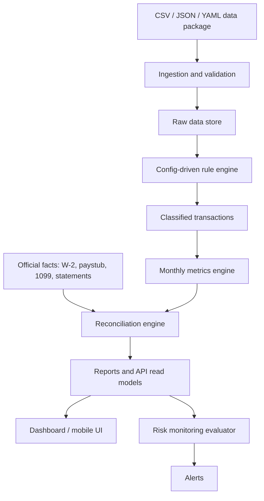

# FIP Technical Design v1

Status: draft
Scope: MVP architecture for standalone FIP module

## Architecture

## Baohe Alignment

FIP starts as an independent module and later exposes a Baohe-compatible module
contract:

- `moduleId`: `finance`
- `routeKey`: `finance`
- `modeAvailability`: `personal`, `demo`
- `requiredCapabilities`: data-package import, local reporting, read-only API
- `approvalGateKeys`: real-bank-auth, payment-action, tax-advice,
  investment-advice

The first integration should be static/report-only. Runtime bank connections
and money movement remain blocked.

## Modules

### Ingestion

Validates files, normalizes dates and currencies, deduplicates rows, and writes
raw records. It does not classify transactions.

### Rule Engine

Loads rule modules from YAML/JSON, validates allowed operators and actions,
sorts by effective priority, applies the first matching rule, and records
classification evidence.

Reference: `rule-engine-pseudocode-v1.md`.

### Review Queue

Stores unmatched or low-confidence transactions. User edits create transaction
overrides or rule proposals; system rule modules are not silently mutated.

### Monthly Metrics Engine

Aggregates classified transactions into spending, income, credit card, internal
flow, savings, and reconciliation read models.

Reference: `monthly-metrics-logic-v1.md`.

### Reconciliation Engine

Uses official facts to calibrate official income, savings, and investment
metrics. It emits `reconciliation_report` rows explaining differences.

### Risk Monitoring

Evaluates YAML-defined alert rules against monthly metrics, accounts, credit
card statements, and data-quality flags.

Reference: `config/risk-monitoring-rules-v1.yaml`.

### API Layer

Provides read APIs for dashboards and reports plus controlled write APIs for
imports, review edits, and rule proposals.

## Data Flow

1. User imports a data package.
2. Ingestion validates shape, row uniqueness, enum values, and required fields.
3. Raw rows are persisted without classification mutation.
4. Rule engine loads active rule modules and classifies each row.
5. Review queue captures unmatched or uncertain rows.
6. Monthly metrics engine aggregates classified data.
7. Official facts reconcile income and savings values.
8. Risk evaluator emits alerts.
9. API and UI read from normalized tables and report views.

## Extensibility

- New institutions: add `institutions/<name>.rules.yaml`.
- New risk policy: add a rule to `risk-monitoring-rules-v1.yaml`.
- New metric: add a calculation section, SQL field, API field, and test case.
- New data source: add an ingestion adapter that outputs the same canonical
  tables.

## Key Non-Goals

- No executable bank/card logic inside the engine.
- No direct account authorization in MVP.
- No payment/transfer execution.
- No unreviewed tax or investment claims.

